# 🚀 SonarCloud Quick Reference Card

## Essential Links
- **SonarCloud Dashboard**: https://sonarcloud.io
- **Your Project**: https://sonarcloud.io/project/overview?id=Nathal25_rightOnTime-Project
- **GitHub Actions**: https://github.com/Nathal25/rightOnTime-Project/actions

## Quick Commands

### Run Tests Locally
```bash
cd rightOnTime
python manage.py test
```

### Check Coverage
```bash
coverage run --source='.' manage.py test
coverage report
coverage html  # Open htmlcov/index.html
```

### Run with Pytest
```bash
pytest --cov=rightOnTime --cov-report=html --cov-report=term
```

## Key Metrics at a Glance

| Metric | Target | What it Means |
|--------|--------|---------------|
| **Code Coverage** | ≥ 60% | How much code is tested |
| **Cyclomatic Complexity** | < 15 | Code simplicity (lower = better) |
| **Code Duplication** | < 3% | Duplicate code blocks |
| **Technical Debt** | Minimize | Time to fix all issues |
| **Code Smells** | 0 | Maintainability problems |

## Pipeline Workflow

```mermaid
graph LR
    A[Push Code] --> B[Run Tests]
    B --> C[Generate Coverage]
    C --> D[SonarCloud Scan]
    D --> E{Quality Gate}
    E -->|Pass| F[Success ✓]
    E -->|Fail| G[Fix Issues ✗]
```



## Setup Checklist

- [ ] Create SonarCloud account
- [ ] Import repository to SonarCloud
- [ ] Copy SONAR_TOKEN from SonarCloud
- [ ] Add SONAR_TOKEN to GitHub Secrets
- [ ] Update sonar.projectKey if needed
- [ ] Update sonar.organization if needed
- [ ] Push code to trigger pipeline
- [ ] Check pipeline status in Actions tab
- [ ] View results in SonarCloud dashboard

## Configuration Files

```
PROJECT/
├── .github/workflows/ci.yml      # Pipeline definition
├── sonar-project.properties      # SonarCloud config
├── .coveragerc                   # Coverage settings
├── pytest.ini                    # Test configuration
└── requirements.txt              # Dependencies
```

## Common Issues & Quick Fixes

### ❌ "No SONAR_TOKEN provided"
```
Add SONAR_TOKEN to GitHub Repository Secrets:
Settings → Secrets and variables → Actions → New secret
```

### ❌ "Coverage file not found"
```bash
# Ensure tests run and generate coverage.xml
cd rightOnTime
coverage run --source='.' manage.py test
coverage xml
```

### ❌ "Quality Gate Failed"
```
1. Check SonarCloud dashboard
2. Click on "Failed Conditions"
3. Fix reported issues
4. Push changes
```

### ❌ "Project not found"
```properties
# Verify in sonar-project.properties:
sonar.projectKey=Nathal25_rightOnTime-Project
sonar.organization=nathal25
```

## SonarCloud Project Configuration

```properties
# Required Settings
sonar.projectKey=Nathal25_rightOnTime-Project
sonar.organization=nathal25
sonar.projectName=RightOnTime Project

# Source & Test Paths
sonar.sources=rightOnTime
sonar.tests=rightOnTime
sonar.test.inclusions=**/tests.py,**/test_*.py

# Coverage Report
sonar.python.coverage.reportPaths=rightOnTime/coverage.xml

# Python Version
sonar.python.version=3.11
```

## GitHub Actions Secret

**Name**: `SONAR_TOKEN`  
**Value**: Get from SonarCloud → My Account → Security → Generate Token

## Quality Gate Default Criteria

- ✅ Coverage on new code > 80%
- ✅ Duplicated lines on new code < 3%
- ✅ Maintainability Rating = A
- ✅ Reliability Rating = A
- ✅ Security Rating = A

## Viewing Results

### In GitHub
1. Go to **Actions** tab
2. Click latest workflow run
3. View job logs
4. Check SonarCloud link

### In SonarCloud
1. **Overview**: Key metrics summary
2. **Issues**: Bugs, vulnerabilities, code smells
3. **Measures**: Detailed metrics
4. **Code**: Browse analyzed code
5. **Activity**: Recent analysis history

## Customization Examples

### Change Coverage Threshold
```ini
# In .coveragerc
[report]
fail_under = 70
```

### Adjust Complexity Limit
```properties
# In sonar-project.properties
sonar.python.cyclomaticComplexity.threshold=10
```

### Exclude More Files
```properties
# In sonar-project.properties
sonar.exclusions=**/migrations/**,**/tests.py,**/admin.py
```

## Useful SonarCloud Filters

```
# View only high severity issues
Severity: High

# Show only new code issues
Type: New Code

# Filter by category
Category: Security, Bug, Code Smell

# Show unresolved issues
Status: Open
```

## Badges for README

Add to your main README.md:

```markdown
[](https://sonarcloud.io/summary/new_code?id=Nathal25_rightOnTime-Project)

[](https://sonarcloud.io/summary/new_code?id=Nathal25_rightOnTime-Project)

[](https://sonarcloud.io/summary/new_code?id=Nathal25_rightOnTime-Project)
```

## Support Resources

- **SonarCloud Docs**: https://docs.sonarcloud.io/
- **SonarCloud Community**: https://community.sonarsource.com/
- **GitHub Actions Docs**: https://docs.github.com/actions
- **Coverage.py Docs**: https://coverage.readthedocs.io/

## Tips for Success

1. 🧪 **Write tests first** - Aim for high coverage
2. 🔍 **Review SonarCloud regularly** - After each push
3. 🛠️ **Fix issues early** - Don't accumulate technical debt
4. 📊 **Monitor trends** - Watch metrics over time
5. 🎯 **Set realistic goals** - Improve gradually

---

**Pipeline Status**: [](https://github.com/Nathal25/rightOnTime-Project/actions/workflows/ci.yml)

**Last Updated**: November 2025
